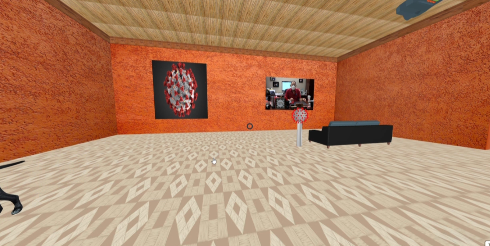
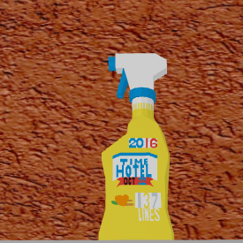
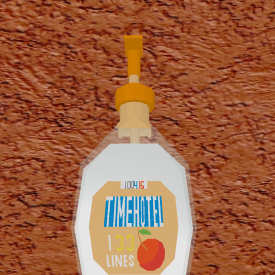
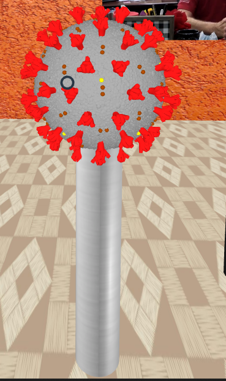
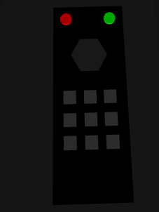

# CS 4331 - Project 1

## Overview

My VR project highlights the affect of Covid-19 on my life.

### Video (Click to Watch)

[](https://youtu.be/mSrkglReQMw "VR Demo")

### Sound Components

- These components emit a sound upon being clicked.




### Functional Components

-These components perform an action when clicked. These make use of Javascript's querySelector function, grabbing hold of the entities and changing their attributes upon click. This functionality can be seen below in the remote example.

```javascript
function remoteClick() {
  var videoFeed = document.querySelector("#covid_video_output");

  if (tvOn) {
    videoFeed.setAttribute("visible", "false");
    tvOn = false;
  } else {
    videoFeed.setAttribute("visible", "true");
    tvOn = true;
  }
}
```

#### Covid Orb

- Orb can be clicked to turn on/off covid mode, making changed to the door signs, projector output, and poster.
  

#### Light Switch

- Can turn on and off the overhead lights for the items displayed on the plinths.
  

#### Remote

- Can be clicked to turn on/off the overhead projector.<br />
  

### Models taken from other sources

- [Sofa](https://poly.google.com/view/7Q_Ab2HLll1)
- [Projector](https://poly.google.com/view/4oVHZbDvwV8)
- [Covid Ball](https://sketchfab.com/3d-models/coronavirus-covid-19-virus-991102145c294fe4b633faecc23f3799)
- [Desk](https://sketchfab.com/3d-models/low-poly-gaming-desk-6f1bc394de704e488d44e77134f23993)
- [Chair](https://sketchfab.com/3d-models/boutique-office-chair-black-205890-ad9904fb0cf64297b10feea31faae21e)
- [Hand Sanitizer](https://poly.google.com/view/8vVKgLRyRYe)
- [Face Mask](https://poly.google.com/view/8ABOEoG76Z6)
- [Dog](https://sketchfab.com/3d-models/dog-5e62ac5714aa44eda8b38adca4a9641b)
- [Amazon Box](https://sketchfab.com/3d-models/amazon-prime-shipping-box-0641e66ea33c415694cf84f786178960)
- [Toilet Paper](https://poly.google.com/view/3fTwIG4NTg3)
- [Cleaning Bottle](https://poly.google.com/view/bnAE4wYavQQ)
- [Light Switch](https://poly.google.com/view/drzI0Tg_uKT)
- [Soccer Net](https://poly.google.com/view/590FRI8s976)

### Models created by me (either Blender or basic shapes)

- Column for Covid Ball
- Lamps
- Plinths
- Door handle
- Stop Sign
- Go Sign
- Remote Control
- Doors
- Soccer Ball
- Remote Control
